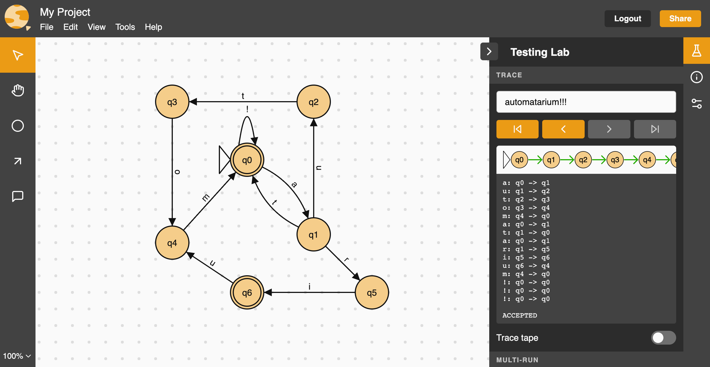

# 🌏 Automatarium

> A place for automata

Automatarium is a modern take on the useful [JFLAP](https://www.jflap.org/), but designed with a modern user interface and quality-of-life features that JFLAP was lacking. Currently, Automatarium fully supports finite automata, with basic  functionality implemented for push-down automata and Turing machines.

💡 For more details on _using_ Automatarium, check out the [user guide](https://github.com/automatarium/automatarium/wiki/Introduction) on the wiki.

## Contributing

For details on contributing to Automatarium, please read the [contributing guide](./CONTRIBUTING.md).

## Contributors

Automatarium is built primarily by [RMIT University](https://www.rmit.edu.au/) students as a capstone project, created by the following students in 2022 (semester 1).

- [Max Reid](https://github.com/Prydeton)
- [Thomas Dib](https://github.com/tdib)
- [Ewan Breakey](https://github.com/giraugh)
- [Benji Grant](https://github.com/GRA0007)
- [Tim Tran](https://github.com/spacediscotqtt)

It has since been picked up and worked on by more capstone groups.

Group 2 - 2022 Semester 2

Implemented support for push-down automata and Turing machines, as well as improving simulation code.

- [Conor Christensen](https://github.com/ConorChristensen-RMIT)
- [Jessani Linsangan](https://github.com/s3844703)
- [Lachlan Blennerhassett](https://github.com/Canni6)
- [Tomas Haddad](https://github.com/tomashaddad)
- [Oliver Hale](https://github.com/s3781403)

Group 3 - 2023 Semester 1

Added tools such as NFA $\rightarrow$ DFA, templates, and reordering. Also converted the frontend to Typescript.
  
- [Ope Abbas](https://github.com/OpeAbbas)
- [Sidhra Fernando-Plant](https://github.com/SidhraFernando-Plant)
- [Lachlan Van Der Klift](https://github.com/LvandoApps)
- [Jake Leahy](https://github.com/ire4ever1190)
- [Aung Pyae Sone](https://github.com/eddie7788)

Group 4 - 2023 Semester 2

Current dev team.

- [Claire Basile](https://github.com/S3865562)
- [Jack Gardner](https://github.com/JackGardnerRMIT)
- [Christopher Truong](https://github.com/Christopher-Truong-s3848927)
- [Ethan Wang](https://github.com/anioncat)
- [Haixu Wang](https://github.com/HaixuWang0615)

For a full list of contributors see: https://github.com/automatarium/automatarium/graphs/contributors

## License

Automatarium is licensed under MIT
