# Components

This file breaks down each component briefly and gives descriptions of its functionality. 

- [Components](#components)
- [Button](#button)
- [CommentRect](#commentrect)
- [ContextMenus](#contextmenus)
  - [Examples](#examples)
- [Details](#details)
- [Dropdown](#dropdown)
  - [Examples](#examples-1)
- [EditorPanel](#editorpanel)
  - [Examples](#examples-2)
- [Footer](#footer)
  - [Example](#example)
- [GraphContent](#graphcontent)
- [GraphView](#graphview)
- [Header](#header)
- [InitialStateArrow](#initialstatearrow)
- [Input](#input)
- [InputDialogs](#inputdialogs)
- [Label](#label)
- [Logo](#logo)
- [Main](#main)
- [Menubar](#menubar)
  - [Menus](#menus)
  - [menuStyle](#menustyle)
- [Modal](#modal)
- [Preference](#preference)
- [ProjectCard](#projectcard)
- [SectionLabel](#sectionlabel)
- [SelectionBox](#selectionbox)
- [Sidebar](#sidebar)
- [Sidepanel](#sidepanel)
- [Spinner](#spinner)
- [StateCircle](#statecircle)
- [Switch](#switch)
- [Table](#table)
- [Toolbar](#toolbar)
- [Tracepreview](#tracepreview)
- [TraceStepBubble](#tracestepbubble)
- [TransitionSet](#transitionset)


# Button
**Returns a wrapper containing the relevant values**

A simple custom button that takes either an icon or children argument to display text/icon.

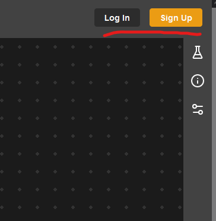

Styled using the buttonStyle.js file - src/components/Button/buttonStyle.js

# CommentRect
**Returns a foreignObject svg element with the appropriate values**

Created by the user when they use the comment tool. Draws a rectangle on the editor containing user entered text.

Dispatches a custom event called 'comment:mousedown' when the user clicks down using their primary mouse key on the comment. Similarly, dispatches a custom event 'comment:mouseup' when the user releases the primary mouse key.

Utilises the selection store (more on this in the hooks section of the code documentation) to save its selected state.
Uses view store to set its .... size / scale / position relative to the editor.

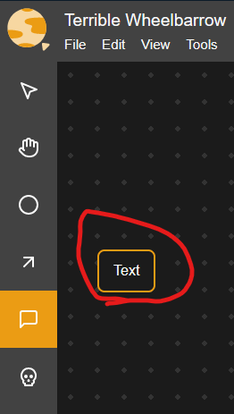

Styled using commentRectStyle.js file.

# ContextMenus
**returns a styled Dropdown component with the appropriate context**

Custom right click menus. graphContextItems.js, stateContextItems.js, commentContextItems.js and transitionContextItems.js contain a json-like array which tells ContextMenus.js what to display when a user right clicks on the appropriate component.

The 'action:' section of these files uses the custom hook useActions and its respective entry in the actions array to determine the functionality of the menu item.

For example, to add a new context menu item, add a new entry into the ___ContextItems.js file (e.g. graphContextItems.js) with an appropriate label and action. Then, in the useActions hook define the action (using the same name as you used in ____ContextItems.js).

Context Menus utilises the custom hook useEvent, and the custom component [dropdown](#dropdown) to display the appropriate dropdown menu on right click.

useEvent detects whether an event ('ctx:svg', 'ctx:state', 'ctx:transition', 'ctx:comment') has been fired, sets the context, which the dropdown component that is returned uses to display the appropriate elements.

## Examples

Context Menu for comment

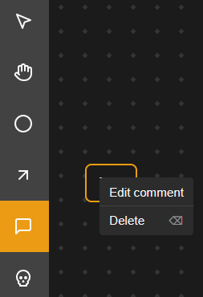

Context Menu for State

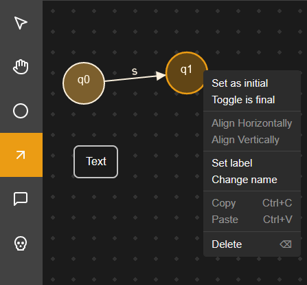

# Details

Unsure what uses this component.

# Dropdown
**returns a wrapper containing information passed to the dropdown component**

To utilise this component, 


## Examples
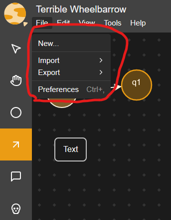


# EditorPanel

Comprised of several different components that create the main editor panel as seen in the examples below.

For interactivity, EditorPanel uses custom hooks for selection and dragging of states, comments and transitions. View the hooks section in the documentation for more information on how these function.

These are:

    - useStateSelection
    - useTransitionSelection
    - useCommentSelection
    - useStateDragging
    - useCommentDragging
    - useTransitionCreation
    - useStateCreation

To draw the panel itself and the related components, it uses GraphContent, GraphView, SelectionBox, TransitionSet, ContextMenus and InputDialogs. For more information on these, view their respective entries in the documentation. The box drawn by the select tool is rendered using SelectionBox.

## Examples
The editor panel is highlighted in blue in the first image.

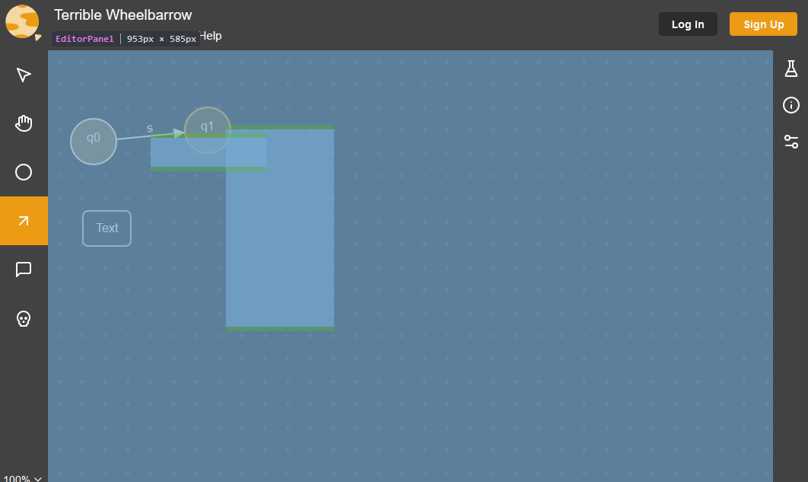 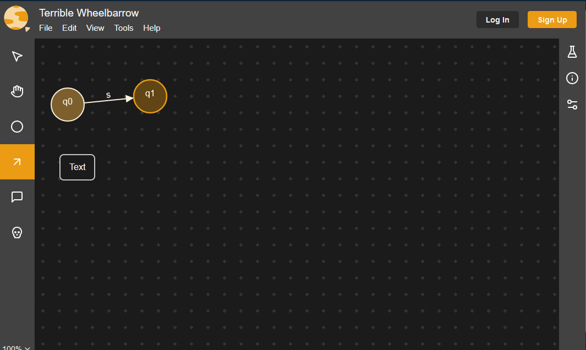


# Footer

Simple component to display the footer on the landing page of the application.

## Example
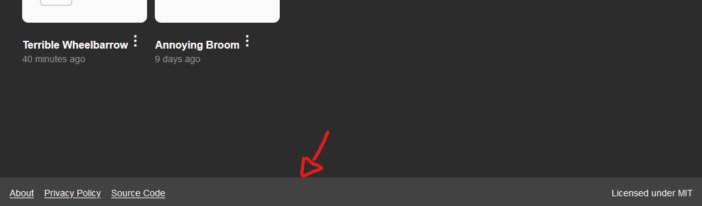

# GraphContent

This component grabs information from the project store about any states/transitions/comments that should be rendered on project initialization (i.e. if the user is coming from a previously created project).

It then ... calculates appropriate position and direction for the transitions.

And finally renders the states, comments, and transitions in their appropriate position. 

# GraphView

Utilises an SVG element to draw inside the browser. GraphView functions within the [EditorPanel](#editorpanel). 

- Dispatches custom mouse events which other components and hooks are able to use (svg:mousedown, svg:mouseup and svg:mousemove)
- Keeps track of browser resizing
- Responsible for managing view dragging (useViewDragging hook)

This makes heavy use of various stores, for more information see the documentation on stores.

# Header

Displays the header on the main page. 


# InitialStateArrow

Contains the information for drawing the initial state arrow on a state. 


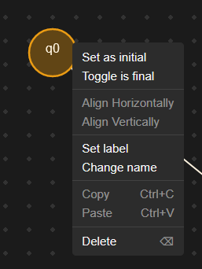

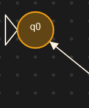

# Input
Component to take user input


Input example in TestingLab

```
        <Input
          onChange={e => {
            setTraceInput(e.target.value)
            setTraceIdx(0)
            setSimulationResult()
          }}
          value={traceInput ?? ''}
          placeholder="Enter a value to test"
        />

```
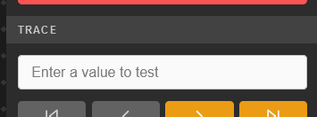

# InputDialogs

Creates the input dialog for transitions/comments/states when the user is editing or creating labels / comments. Also responsible for saving this information into the project store.


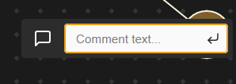


# Label
Responsible for handling some minor display styling for labels

Example of label on a state in the editor panel
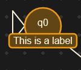

# Logo
Responsible for drawing the planet in the top left of the page

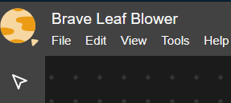


# Main

Major component/wrapper for building pages


Code example from the about page
```  
  <Main
    <Header center linkTo="/" />
    <h2>About</h2>

    <p>Automatarium is a student-led project to provide a modern, intuitive interface for creating and testing automata.</p>
    <p>Inspired by <a href="https://www.jflap.org/" target="_blank" rel="nofollow noreferrer">JFLAP</a>, Automatarium allows you to draw a graph, define transitions, and use the Testing Lab to test inputs. There are plans to implement other types of automata such as Push-Down Automata and Turing Machines in the future.</p>
    <p>Automatarium is open-source, licensed under MIT, and <a href="https://github.com/automatarium/automatarium" target="_blank" rel="nofollow noreferrer">hosted on Github</a>. If you spot any bugs or have a feature request, you are welcome to <a href="https://github.com/automatarium/automatarium/issues/new/choose" target="_blank" rel="nofollow noreferrer">create an issue</a>.</p>
  </Main>
```

# Menubar
Responsible for drawing the menu bar at the top of the editor panel and handling edit/saving of the project name on the menu bar.

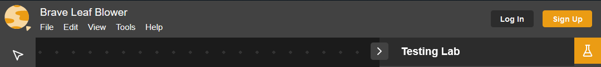

## Menus
Json Style arrays for creating the dropdown items in the menu bar dropdown tabs (file, edit, view, tools, help).

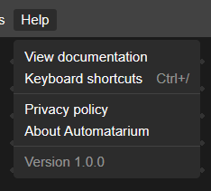


## menuStyle

Styling component for the menu bar

# Modal

- [ ] To do: describe what this does

# Preference

Component to display information with a label and a description.

Simple implementation: (from Options.js)
```
      <Preference
        label="State identifier"
        description="Used to denote a state"
      >
```


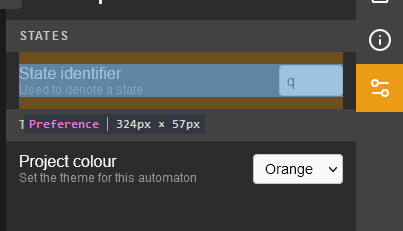

# ProjectCard

Used when needing to draw a project card (see below for an example)

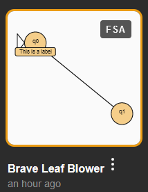
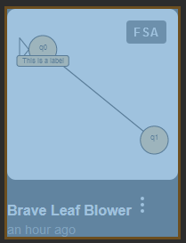


# SectionLabel

Used to split up different sections and give them headings.

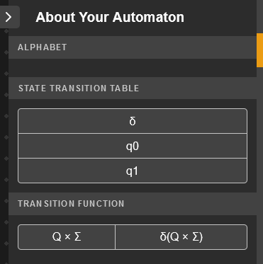

Highlighted example of the state transition table

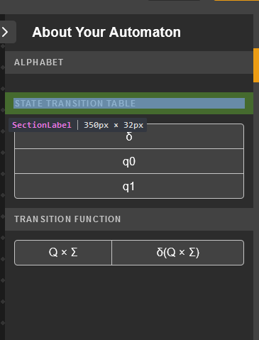

# SelectionBox
Draws a box that follows the mouse drag (on mouse 1 click down) in the editor panel. Then selects any states, transitions or comments within the boxes X/Y coordinates.

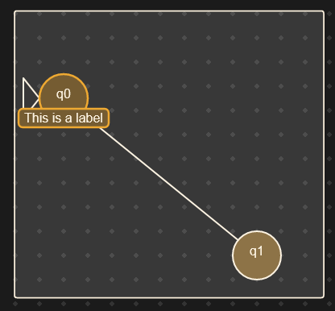


# Sidebar

Used to create styled buttons. 

An example from the toolbar
```
<SidebarButton
          key={toolOption.label}
          onClick={() => setTool(toolOption.value)}
          $active={tool === toolOption.value}
          onMouseEnter={e => {
            toolPopupHover.current = { ...toolPopupHover.current, value: toolOption.value }
            window.setTimeout(() => {
              if (toolPopupHover.current.value !== toolOption.value) return
              const box = e.target.getBoundingClientRect()
              setToolPopup({ visible: true, y: box.y, tool: tools.find(t => t.value === toolOption.value) })
            }, toolPopupHover.current.timeout || 1000)
          }}
          onMouseLeave={e => {
            toolPopupHover.current = { value: undefined, timeout: (e.relatedTarget.tagName === 'BUTTON' && toolPopup.visible) && 10 }
            setToolPopup({ ...toolPopup, visible: false })
          }}
        >
          {toolOption.icon}
</SidebarButton>
```

# Sidepanel

Responsible for drawing the sidepanel to the right of the editor panel, and the opening and closing of it.


An example of the sidepanel closed.

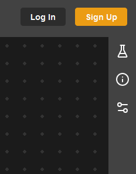

An example of the sidepanel open.

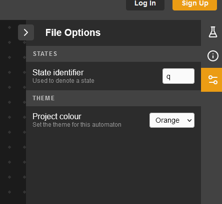

# Spinner

A simple component that draws a loading-style icon where one is needed. 

An example on the share page of the spinner icon being conditionally loaded:

```
 {loading ? <Spinner /> : <>
```

# StateCircle

Draws the state circle on the editor panel. Also responsible for dispatching custom events when the states are clicked on (one for mouseup, one for mousedown).

To access state mouse events, you can use 'state:mouseup' and 'state:mousedown'. 

Example:

```
    useEvent('state:mouseup', e => {
        if (tool === 'delete') {
            removeStates(selectedStates)
            selectNone()
            commit()
        }
    })
```


# Switch

Adds a toggleable switch on the screen.

Code Example:

```
<Switch type="checkbox" {...register('showGrid')} />
```

(Switch can be seen on the right, orange = toggled on, grey = toggled off)

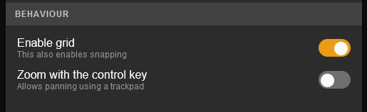


# Table

Global styling component for the table element.

# Toolbar

Draws the toolbar on the left side of the screen. 

Responsible for setting the currently active tool. 

To add a new tool, in the const tools array, give the tool a label, hotkey, description, value, an ICON, and an animation.

When a user clicks the tool it will set it in the tool store. To give this tool a function, you can create a custom hook (see useDeleteTool as an example) and then call the tool in the editor panel.

The animations are lottie files, which can be created using online tools or in Adobe After Effects.

Icons come from lucide-react, for a full list of possible icons see https://lucide.dev/.

Toolbar (left)

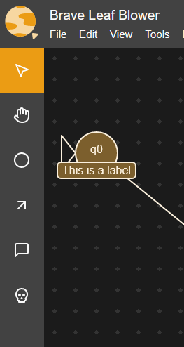


# Tracepreview


Implementation of tracepreview in testing lab.

```
<TracePreview trace={result} step={idx} />
```

# TraceStepBubble


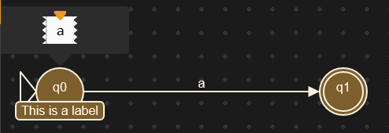

# TransitionSet

Draws transitions on the screen and handles mouseup/mousedown events for transitions. 

To access the custom transition event, you can use 'transition:mouseup' or 'transition:mousedown'.

```
useEvent('transition:mouseup', showContext('ctx:transition'))
```
