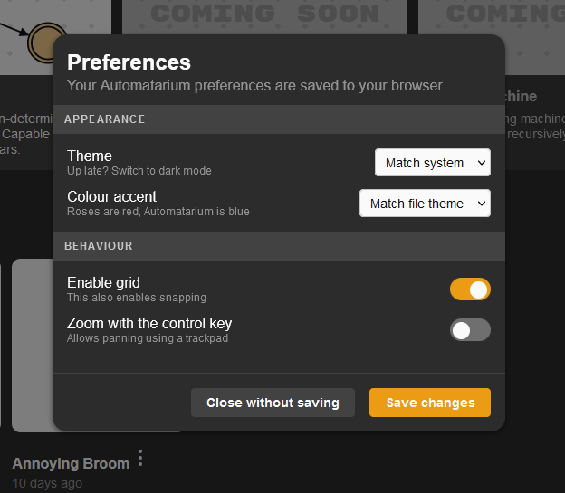
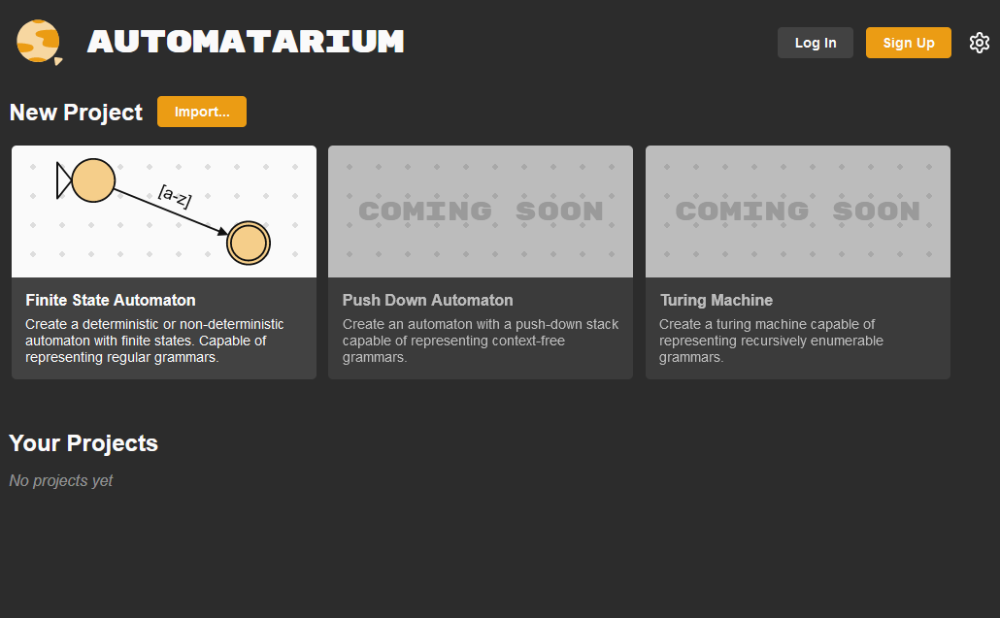
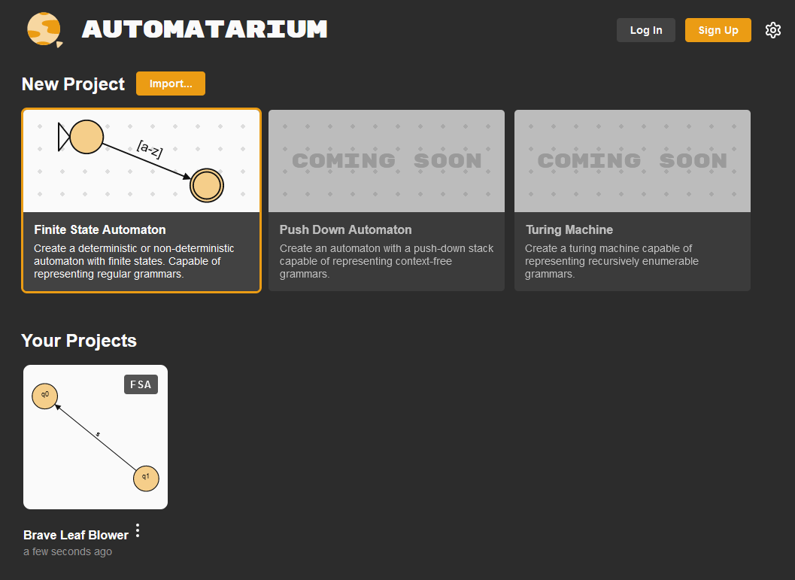
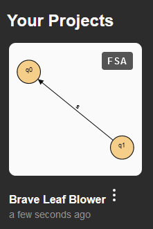

# Stores 

Stores are created using [zustand](https://www.npmjs.com/package/zustand). Zustand is a package used to manage state/persist globally. 

<br>

- [Stores](#stores)
- [useExportStore](#useexportstore)
- [usePreferencesStore](#usepreferencesstore)
  - [Example](#example)
- [useProjectsStore](#useprojectsstore)
- [useProjectStore](#useprojectstore)
- [useSelectionStore](#useselectionstore)
- [useThumbnailStore](#usethumbnailstore)
- [useToolStore](#usetoolstore)
  - [Example](#example-1)
- [useViewStore](#useviewstore)

<br>

# useExportStore

Creates a store that: 
- contains default options to display when the user is about to export an image (see documentation: pages/ExportImage.tsx)
- Stores visibility options for ExportImage to use
- Allows the user to change previous options and stores these

Editor.js also uses this when creating a new project to clear export settings. 

# usePreferencesStore

Stores user preferences for application theming/behaviour. 

Main page & click cog/settings in top right opens preferences.

## Example
The below image shows the default settings as defined inside usePreferencesStore.js.



# useProjectsStore

Creates a store of projects to be used by functions like autosave, logout (clears projects from store), delete projects.

The below image demonstrates an empty project store.



The image below demonstrates where the project store has come into use, after creating a project and then leaving the page (autosave feature).




# useProjectStore

Different to use projectsStore, this instead stores the specific information required to create / re-create a project. Information such as states, transitions, comments and their positions in the editor.
 It also includes logic and functions to create, edit, delete and update states, transitions and comments. 

 ```  
 /* Update a state by id */
  updateState: state => set(produce(({ project }) => {
    project.states = project.states.map(st => st.id === state.id ? {...st, ...state} : st)
  })),
```

# useSelectionStore

Used for: (storing the selected data of comments/states/transitions, deselecting, selecting)

used in: various tools (select tool, delete tool (?), editor panel)

```
const useSelectionStore = create(set => ({
  selectedStates: [],
  selectedTransitions: [],
  selectedComments: [],
  setComments: selectedComments => set({ selectedComments }),
```


# useThumbnailStore

Responsible for setting, removing and clearing thumbnails.



Example of thumbnail store being used in useImageExport

```
const setThumbnail = useThumbnailStore(s => s.setThumbnail)
```
```
  // Generate thumbnail
  useEffect(() => window.setTimeout(() => {
    const { svg } = getSvgString()
    setThumbnail(project._id, 'data:image/svg+xml;charset=utf-8,'+encodeURIComponent('<?xml version="1.0" standalone="no"?>\r\n'+svg))
  }, 200), [project])
}
```

# useToolStore

Simple storage to define what tool the user currently has selected, default is cursor. Used by many different pages, components and hooks.

If adding a new tool, this can be accessed to set the tool for other variables to use. 

## Example
Demonstrates the tool store being set in toolbar.js
```
const Toolbar = () => {
  const { tool, setTool } = useToolStore()
```
```
        <Sidebar.Button
          key={toolOption.label}
          onClick={() => setTool(toolOption.value)}
```

Demonstrates the tool store being used to check the currently active tool in useDeleteTool
```
const useDeleteTool = () => {
    const tool = useToolStore(s => s.tool)
```
```
    //Selects the state the user clicks on (mouse down)
    useEvent('state:mousedown', e => {
        const selectedStateIDs = selectState(e)
        if (tool === 'delete') {
            setSelectedStates(selectedStateIDs)
        }
    })
```

# useViewStore

Stores and defines various values about the screenspace that the main window is currently occupying. 

Example of useViewStore being used in useViewDragging
```
  const viewPosition = useViewStore(s => s.position)
  const viewScale = useViewStore(s => s.scale)
  const setViewPosition = useViewStore(s => s.setViewPosition)
  const setViewPositionAndScale = useViewStore(s => s.setViewPositionAndScale)
```

```
      setViewPositionAndScale({
        x: viewPosition.x - mx * scrollAmount,
        y: viewPosition.y - my * scrollAmount,
      }, newScale)
```


